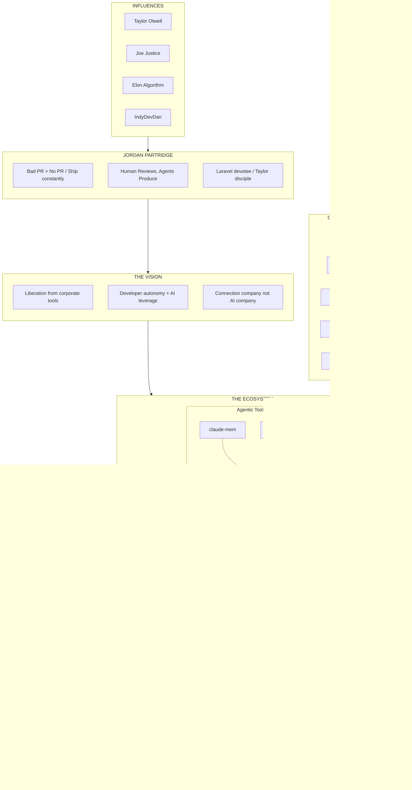

# The Vision

## Ecosystem Architecture

## The Vision

**Liberation from corporate tools** - Breaking free from expensive, bloated enterprise software that doesn't serve individual developers or small teams.

**Developer autonomy + AI leverage** - Empowering individual developers with AI capabilities to match team-level output.

**Connection company, not AI company** - Building connections between tools, services, and workflows. AI is the means, not the product.

## The Ecosystem

### Conduit UI
GitHub API layer and integration framework. Clean, Laravel-style interface to GitHub with modular verb packages:

- **Connector**: Core HTTP transport and authentication
- **Verb Packages**: PRS, Issues, Repos, Commits, Actions - each a focused, composable module

### THE SHIT
Application layer built on the infrastructure:

- **Chat App**: Real-time communication interface
- **Agents**: Autonomous workers executing tasks from specifications
- **Brain**: Knowledge management and context storage

### Agentic Toolkit
Developer tools and infrastructure:

- **Laravel Zero CLI**: Single binary CLI, gateway to all agent capabilities
- **Knowledge Repo**: Personal knowledge management and agent context
- **claude-mem**: Memory layer for persistent agent context
- **Claude Skill**: Reusable, shareable agent capabilities

## Operating Principles

### Context is Finite
Respect token limits. Compress information without losing meaning. Tools must be context-aware and efficient.

### Agents Never Block
Async by default. Agents work independently within boundaries. Human review after production, not during.

### The Spec IS the Program
Well-written specifications become executable. The gap between design and implementation shrinks.

### Autonomy with Guardrails
Agents act freely within defined boundaries. Trust but verify. Design systems with safe failure modes.

### CLI over MCP Overhead
Command-line interfaces are simple, composable, and universal. Direct tool invocation beats abstraction layers.

## Implementation Status

### Current State (December 2025)
- Connector package: Core HTTP transport layer
- Exception handling: GitHub-specific errors implemented
- Architecture: Moving toward modular verb packages

### Near-Term Goals
1. Verb package separation into standalone modules
2. CLI integration with verb packages
3. Agent integration for autonomous operations
4. Knowledge layer with persistent context

### Long-Term Vision
- Ecosystem maturity with seamless integration
- Community adoption and contribution
- Agent marketplace for shareable skills
- Full autonomy for end-to-end workflows

---

For the complete philosophy and detailed explanations, see the [full ecosystem vision documentation](https://github.com/jordanpartridge/personal-knowledge-management/blob/master/docs/ecosystem-vision.md).
